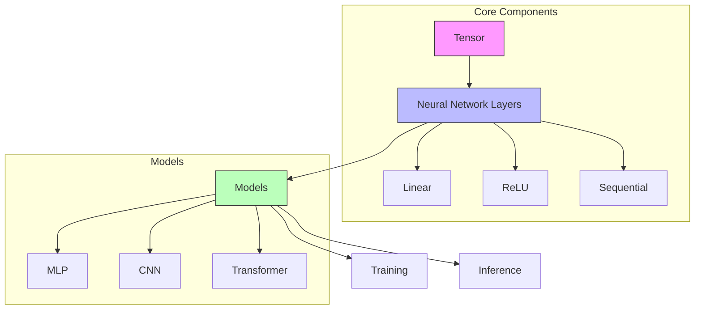

# LLM from Scratch in Rust

A step-by-step implementation of a language model from the ground up, focusing on understanding the core concepts and implementation details of modern language models.

## Project Architecture



## Project Structure

## Learning Path

### 1. Neural Network Fundamentals

- Building blocks: Tensors and automatic differentiation
- Implementing a simple MLP from scratch
- Training on MNIST digit classification

### 2. Deep Learning Core

- Advanced optimizations: BatchNorm, Dropout
- Implementing CNNs for computer vision
- Transfer learning and fine-tuning

### 3. Sequence Models & Attention

- RNNs and LSTMs from scratch
- Attention mechanisms
- The Transformer architecture

### 4. Modern LLM Components

- Tokenization (Byte Pair Encoding)
- Positional encodings
- Multi-head attention
- Model scaling and optimization

### 5. Full LLM Implementation

- GPT-style architecture
- Training pipeline
- Inference optimization
- Fine-tuning and alignment

## Getting Started

### Prerequisites

- Rust (latest stable version)
- Cargo
- (Optional) CUDA for GPU acceleration

### Building

```bash
# Navigate to the exercise directory
cd exercises/llm-from-scratch

# Build in release mode (recommended for better performance)
cargo build --release

# Run tests
cargo test
```

## Current Progress

### Neural Network Module

- [x] Basic tensor operations
- [ ] Automatic differentiation
- [ ] Layer implementations (Dense, ReLU, etc.)
- [ ] Loss functions
- [ ] Optimizers

## Project Structure

```
llm-from-scratch/
├── Cargo.toml          # Project configuration and dependencies
├── README.md           # Project documentation
├── src/
│   ├── lib.rs          # Core library exports and module declarations
│   ├── tensor.rs       # Tensor operations and automatic differentiation
│   └── nn/             # Neural network building blocks
│       ├── mod.rs      # Module definitions and traits
│       ├── linear.rs   # Dense/fully-connected layers
│       ├── activation.rs # Activation functions (ReLU, etc.)
│       └── sequential.rs # Container for stacking layers
└── examples/           # Example usage
    └── mnist.rs        # MNIST classification example
```

### Key Components

1. **Tensor**
   - Multi-dimensional array operations
   - Automatic differentiation
   - GPU acceleration support (planned)

2. **Neural Network**
   - Linear layers
   - Activation functions
   - Sequential model container
   - Loss functions (coming soon)
   - Optimizers (coming soon)

3. **Examples**
   - MNIST classification
   - More examples to come...

## License

This project is licensed under the MIT License - see the [LICENSE](LICENSE) file for details.
